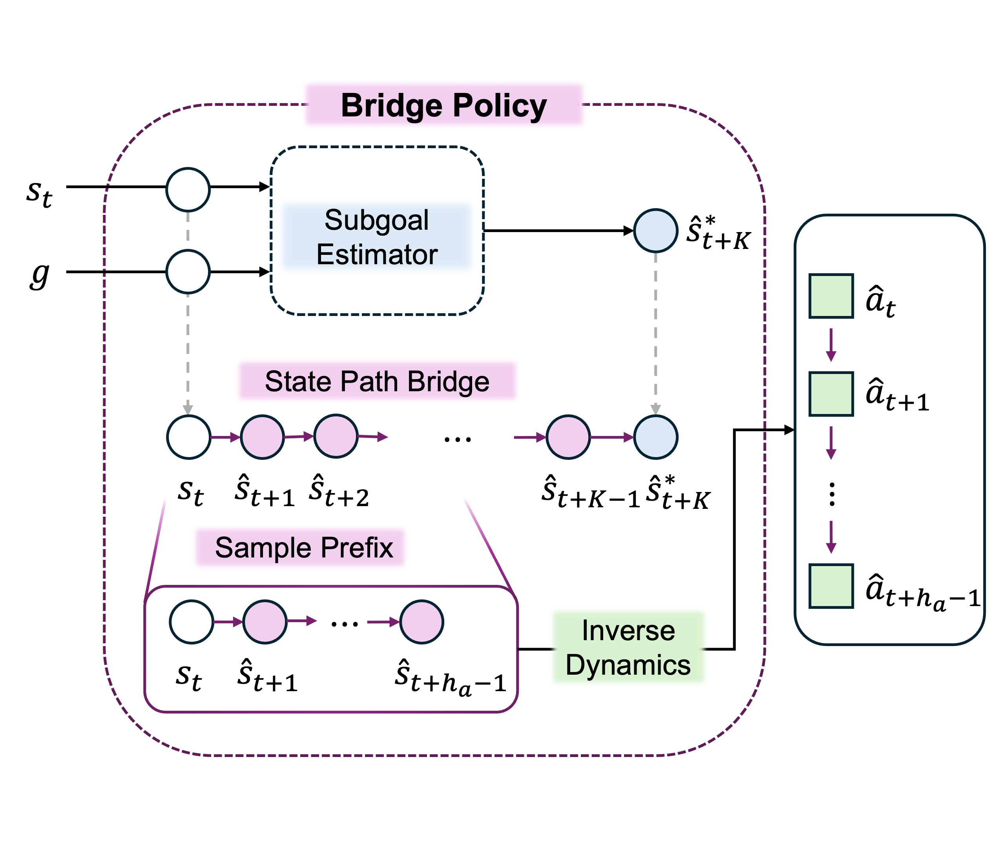

# PathBridger

## Action-free offline + online study

The exact information boundary, training budget, evaluation schedule, method
labels, and aggregation rules are specified in
[`docs/action_free_o2o_protocol.md`](docs/action_free_o2o_protocol.md).

This worktree adds the `PBF-OnlineIDM` setting and the external comparison
suite.  In the proposed method, offline PBF contains no IDM parameters and
online optimization updates only a separately initialized IDM.  External
baselines retain their native online learners.

Implemented algorithms:

- `pbf_online_idm`
- `gc_mscp_style`
- `hiql_endpoint_online`
- `gc_af_guide` (explicit goal-conditioned OGBench adaptation)
- `gc_oso_decqn_factorized` (paper reimplementation and GC adaptation)
- `gc_sac` and `gc_td3` with future HER
- `gc_sac_50_50` full-action symmetric-replay upper bound

Pretrain an action-free PBF with the existing offline entry point:

```bash
python main.py --agent=configs/pbf_af/antmaze_medium.py --seed=0
```

Run the full proposed pipeline, optionally restoring that PBF checkpoint:

```bash
python train_af.py \
  --algorithm=pbf_online_idm \
  --pbf=configs/pbf_af/antmaze_medium.py \
  --pbf_restore_path=/path/to/params_1000000.pkl \
  --online_steps=1000000 \
  --seed=0
```

Run an external baseline:

```bash
python train_af.py \
  --algorithm=gc_mscp_style \
  --env_name=antmaze-medium-navigate-v0 \
  --online_steps=250000 \
  --seed=0
```

The full screening protocol uses one million primitive environment steps, a 10k
random-action grounding phase, checkpoints at 0/10k/25k/50k/100k/250k/500k/1M,
five seeds, and ten episodes for each of the five official tasks per checkpoint.
Its primary sample-efficiency statistic is AUC@250k; AUC@1M and Success@1M are
reported separately.

`train_af.py` writes `offline.csv`, `online.csv`, `eval.csv`, immutable
provenance metadata, and component-wise checkpoints.  Evaluate one checkpoint
with `evaluate_af.py --checkpoint=<step_*.pkl>`.  Generate the staged P0 smoke
manifest and aggregate completed runs with:

```bash
python scripts/make_af_manifest.py --suite=p0_smoke --output=p0_smoke.csv
python aggregate_results.py --root=exp/pbf_af_o2o
```

Promote to `--suite=pilot` only after the diagnostic gate passes.  The
280-run `--suite=screening` manifest is deliberately labeled pre-tuning
screening because PBF has paper-selected environment-specific settings while
the local baseline ports currently use global defaults.

The aggregate output keeps action-free, online-only, and full-action upper-bound
groups separate.  Reference repositories and audited commits are pinned in
`third_party_refs.json`.

This is the compact, actor-free distribution of PathBridger for state-based
offline goal-conditioned reinforcement learning on OGBench.

PathBridger learns exactly four components:

1. a bounded transitive state-goal value and its EMA target,
2. a value-weighted $K$-step endpoint proposer,
3. an endpoint-pinned residual state-space bridge, and
4. an inverse-dynamics model (IDM) that decodes the first five bridge
   transitions into actions.

Both paper endpoint variants are included:

- **PBF** uses a conditional rectified flow for endpoint displacements.
- **PBG** uses a conditional diagonal Gaussian.

The endpoint backend is independent of the bridge-prefix backend. The default
`prefix_model=deterministic` preserves PB, while `low_rank_gaussian` and
`joint_flow` learn joint stochastic corrections to the executed five-step
state prefix.

There is no neural actor, action-conditioned critic, actor finetuning stage, or
Triangle-Q dependency in this distribution.

## Architecture



The diagram is the method overview bundled with the PathBridger paper source.

## Layout

```text
Pathbridger_dist/
├── agents/
│   ├── pathbridger.py       # TransV, endpoint, bridge, IDM, and orchestration.
│   └── prefix_generators.py # Joint Gaussian and flow prefix distributions.
├── assets/
│   └── architecture.jpg     # Paper's bridge-policy overview.
├── configs/
│   ├── pbf/                 # Eight PBF paper configurations.
│   └── pbg/                 # Eight PBG paper configurations.
├── envs/
│   └── env_utils.py         # State-based compact OGBench loading.
├── utils/
│   ├── datasets.py          # Path, endpoint, and transitive-value batches.
│   ├── evaluation.py        # Five-task OGBench environment evaluation.
│   ├── flax_utils.py        # Unified checkpoints and training state.
│   ├── goal_representation.py
│   ├── log_utils.py
│   └── networks.py
├── main.py                  # Offline training.
└── evaluate.py              # Standalone checkpoint evaluation.
```

The root entry points only assemble experiments. All PathBridger mathematics
and inference live in `agents/pathbridger.py`, following the same division of
responsibility as FQL.

## Installation

Python 3.10 or newer is required.

```bash
cd Pathbridger_dist
python -m venv .venv
source .venv/bin/activate
pip install -e .
```

Install the JAX build appropriate for the host accelerator before training.
Weights & Biases is optional:

```bash
pip install -e ".[tracking]"
```

## Training

The default command trains the paper PBF configuration for
`antmaze-medium-navigate-v0`:

```bash
python main.py --seed=0
```

The editable install also provides the equivalent `pathbridger-train` and
`pathbridger-eval` commands.

Select any paper configuration with `--agent`:

```bash
python main.py \
  --agent=configs/pbf/cube_double.py \
  --seed=0 \
  --run_group=paper
```

Training uses one million gradient steps, a batch size of 1024, and saves every
100k steps by default. The checkpoints used by the paper protocol—800k, 900k,
and 1M—are therefore always available.

Host batch sampling is prefetched on one worker by default and can be disabled
with `--noasync_prefetch`. Checkpoint boundaries preserve the exact sampler RNG
state used for deterministic resume.

An explicit directory containing compact OGBench train/validation shards can be
passed with `--dataset_dir`. Run `python main.py --helpfull` for runtime and
logging flags.

Outputs use one unified checkpoint:

```text
exp/pathbridger/<run_group>/<experiment>/
├── flags.json
├── train.csv
├── eval.csv
└── checkpoints/
    ├── params_800000.pkl
    ├── params_900000.pkl
    └── params_1000000.pkl
```

These checkpoints are intentionally not compatible with the research
repository's separate dynamics, critic, and actor checkpoints. A unified
checkpoint includes the agent, optimizer, JAX key, and host sampler RNG states,
so interrupted offline training can resume without resetting its batch stream.

## Evaluation

Training and standalone evaluation both use the standard five predefined
OGBench tasks. Each episode runs to the environment's advertised maximum
length, actions are clipped to the environment bounds, and success is the
any-step aggregation of `info["success"]`.

```bash
python evaluate.py \
  --agent=configs/pbf/cube_double.py \
  --checkpoint_dir=exp/pathbridger/paper/<run>/checkpoints \
  --checkpoint_step=1000000 \
  --episodes=50
```

For an exact `params_<step>.pkl` path, the step is inferred from the filename;
for a checkpoint directory, pass `--checkpoint_step`.

The configuration supplies the paper's endpoint candidate count $N$ and
sampling temperature $T$.

## Paper configurations

The following values are transcribed from the paper table
`tab:pathbridger_env_complete`. $c_{\mathrm{sg}}$ is the endpoint
value-weight scale and $\lambda$ is the value distance-weight exponent.
$N$ and $T$ are the Best-of-$N$ candidate count and sampling temperature.

### PBF

| Config | Environment | $K$ | $\gamma$ | $c_{\mathrm{sg}}$ | $\lambda$ | $N$ | $T$ |
|---|---|---:|---:|---:|---:|---:|---:|
| `pbf/antmaze_medium.py` | antmaze-medium-navigate-v0 | 25 | 0.99 | 10 | 0.0 | 2 | 0.25 |
| `pbf/antmaze_large.py` | antmaze-large-navigate-v0 | 25 | 0.995 | 10 | 0.0 | 16 | 0.5 |
| `pbf/cube_single.py` | cube-single-play-v0 | 40 | 0.99 | 5 | 0.7 | 1 | 0 |
| `pbf/cube_double.py` | cube-double-play-v0 | 40 | 0.99 | 10 | 1.0 | 2 | 0.25 |
| `pbf/cube_triple.py` | cube-triple-play-v0 | 40 | 0.995 | 10 | 1.0 | 1 | 0 |
| `pbf/puzzle_3x3.py` | puzzle-3x3-play-v0 | 25 | 0.99 | 10 | 0.5 | 32 | 1.0 |
| `pbf/puzzle_4x4.py` | puzzle-4x4-play-v0 | 25 | 0.99 | 10 | 2.0 | 32 | 1.0 |
| `pbf/scene.py` | scene-play-v0 | 25 | 0.99 | 5 | 1.0 | 16 | 0.5 |

### PBG

| Config | Environment | $K$ | $\gamma$ | $c_{\mathrm{sg}}$ | $\lambda$ | $N$ | $T$ |
|---|---|---:|---:|---:|---:|---:|---:|
| `pbg/antmaze_medium.py` | antmaze-medium-navigate-v0 | 25 | 0.99 | 10 | 0.0 | 1 | 0 |
| `pbg/antmaze_large.py` | antmaze-large-navigate-v0 | 25 | 0.995 | 10 | 0.0 | 1 | 0 |
| `pbg/cube_single.py` | cube-single-play-v0 | 25 | 0.99 | 10 | 0.7 | 1 | 0 |
| `pbg/cube_double.py` | cube-double-play-v0 | 25 | 0.99 | 10 | 1.0 | 1 | 0 |
| `pbg/cube_triple.py` | cube-triple-play-v0 | 25 | 0.995 | 10 | 1.0 | 1 | 0 |
| `pbg/puzzle_3x3.py` | puzzle-3x3-play-v0 | 40 | 0.99 | 10 | 0.5 | 2 | 0.25 |
| `pbg/puzzle_4x4.py` | puzzle-4x4-play-v0 | 40 | 0.995 | 10 | 2.0 | 16 | 0.5 |
| `pbg/scene.py` | scene-play-v0 | 40 | 0.99 | 5 | 1.0 | 16 | 0.5 |

## Goal-sampling mixes

Goal probabilities use the paper's four-tuple order
`(p_cur, p_geom, p_traj, p_rand)`. There is no separate geometric-sampling
boolean.

- `actor_p=(0, 0, 1, 0)` samples ordinary trajectory-future goals for endpoint
  supervision. Here `actor` follows the paper's “endpoint/actor goal mix”
  label; the distribution does not contain a neural actor.
- `critic_p=(0, 1, 0, 0)` samples geometric future goals for the scalar
  transitive value.

`p_geom` and `p_traj` are mutually exclusive future-goal implementations.
Because the final transitive value loss requires an ordered in-trajectory pair,
`critic_p` must place all probability on either `p_geom` or `p_traj`.

## Stochastic bridge prefixes

A stochastic prefix is trained as a normalized residual around the detached
deterministic bridge reference. Only the five states that can be executed
before replanning are modeled; no full K-step stochastic path is created.
Per-dimension scales are computed from the training observations and stored in
both run and checkpoint metadata.

```bash
# Low-rank joint Gaussian, default rank 8.
python main.py --agent=configs/pbf/cube_double.py \
  --agent.prefix_model=low_rank_gaussian

# Flattened joint rectified flow, default 8 Euler steps.
python main.py --agent=configs/pbf/cube_double.py \
  --agent.prefix_model=joint_flow
```

Inference first selects one endpoint with the unchanged online TransV score
$V(s,z)V(z,g)$. `eval_prefix_selection=sample_one` then draws exactly one
prefix for that endpoint. The optional `transv_chain` mode compares M stochastic
prefixes, optionally including the deterministic prefix at candidate zero,
using the EMA TransV chain score. It never expands every endpoint into M
prefixes.

The stochastic distribution loss is deliberately unweighted. Keep
`path_weight_beta=0` for the primary deterministic/Gaussian/flow comparison;
temporal-geodesic weighting should be enabled only as a separate ablation.

## Temporal-geodesic bridge weighting

The bridge objective additionally reweights each real dataset path by its
one-sided temporal-geodesic defect under the EMA target TransV. For the first
five transitions toward the padded trajectory endpoint, it estimates
$d_i=\log V_{\mathrm{EMA}}(x_i,z)/\log\gamma$ and scores

\[
E(\tau,z)=\operatorname{mean}_{i\in A}
\left[\max\left(0,\min(1,d_i)+d_{i+1}-d_i\right)\right],
\]

where $A$ excludes transitions whose current state already equals the
endpoint. The per-path bridge weight is
$w=\operatorname{clip}(\exp(-\beta E),w_{\min},1)$, detached from gradients,
and the weighted bridge loss is normalized by the sum of weights.

This stochastic branch defaults to `path_weight_beta=0` for clean
backend comparisons. When enabled with the recommended `path_weight_beta=0.25`,
weighting uses a 100k-step TransV warm-up and a 100k-step linear ramp; this
avoids suppressing useful paths with an unreliable early value estimate.
`path_weight_min=0.1` bounds the down-weighting. Geometry metrics
include path energy, monotonic-violation rate, active-transition fraction,
weight statistics, and effective sample-size fraction.

## Fixed implementation choices

The following are code constants rather than configuration options:

- three 512-unit GELU layers with layer normalization,
- Adam with learning rate $3\times10^{-4}$,
- value expectile 0.7 and EMA rate 0.005,
- base and action horizons of 5,
- endpoint-weight cap 5,
- eight Euler steps for PBF,
- unit coefficients for the value, endpoint, bridge, and IDM losses.

Bridge interpolation, endpoint mask, and product endpoint score:

$$
\alpha_i=(i/K)^{0.8},\qquad
m_i=\frac{i(K-i)}{K^2},\qquad
V(s,z)\,V(z,g).
$$

Distance weighting uses the target value without an undocumented clip and is
applied to both base and transitive value losses.

For compatibility with the experiments that produced the reported results,
training keeps the research sampler's close-goal behavior: when a sampled final
goal occurs before $t+K$, the endpoint is clipped to that goal and the five
supervised bridge-prefix targets are padded with the goal state.
